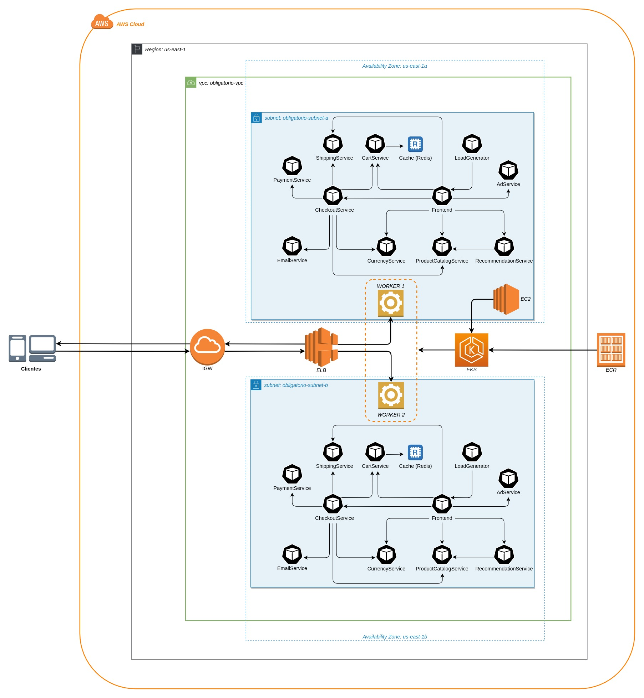
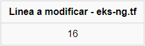

<p align="center">

</p>

# Descripción de la solución

Este repositorio, y la documentación contenida en él, representan la entrega final del trabajo práctico correspondiente a la asignatura *Implementación de Soluciones cloud*, dentro del marco del quinto semestre de la carrera *Analista en Infraestructura Informática*, en la *Universidad ORT Uruguay*.

Con la información contenida en el repositorio, el usuario estará en capacidad de hacer un deploy automatizado de la web Online Boutique, haciendo uso únicamente del comando `terraform apply`

# Dinámica de trabajo

En primer lugar, se generó un repositorio público basado en el [contenido](https://github.com/ISC-ORT-FI/online-boutique) brindado por los docentes. 

Luego de esto, se asignaron permisos de edición a todos los integrantes del grupo, para poder trabajar de manera colaborativa.

Se personalizó el archivo *.gitignore* para que todos los archivos referentes a cada workspace de Terraform no sean incluidos en cada uno de los commits realizados.
Una vez que cada integrante logró clonar el repositorio de manera local en su PC, se procedió a desarrollar los componentes de la Infraestructura a desplegar, tratando de adoptar el siguiente orden:
>1. Componentes de networking, desde lo más macro hasta lo más específico  
    *  VPC    
    * Internet Gateway, con su correspondienre Route Table para garantizar salida a Internet   
    * Subnets   
    * Security Group para acceder por SSH al equipo Bastión (puerto 22)  
>2. Componentes de Kubernetes (EKS)  
    * EKS Cluster  
    * EKS Node Group, compuesto por dos Worker Nodes. Cada uno de los Workers estará ubicado en diferente Zona de Disponibilidad para brindar redundancia en el servicio.  
>3. Instancia Bastión  

Al lograr un despliegue exitoso de toda la Infraestructura, se procedió a crear un Script para aprovisionar el Bastión. En esta etapa se describieron las acciones que se necesitaba realizar para lograr que la instancia esté en capacidad de desplegar automáticamente la web Online Boutique:
>* Actualizar todos los paquetes del sistema a su versión más reciente  
>* Instalación de dependencias necesarias para una correcta interacción con todos los servicios que se requieren para hacer el despliegue (Git, Docker, Kubernetes v1.21.1)  
>* Clonado del repositorio para tener los archivos necesarios para realizar el despliegue de los microservicios  
>* Carga de credenciales de AWS en los archivos *config* y *credentials*, para una correcta interacción con los servicios de Amazon  
>* Conexión al contexto del Cluster de EKS creado previamente
>* Ejecución de comandos de *kubectl* que permiten el despliegue de los microservicios  

Luego de lograr el despliegue de la Infraestructura, inicializar el Bastión y conectar el mismo al contexto del Cluster de EKS, se procedió a buildear las imágener de Docker de manera local, haciendo uso de los Dockerfile provistos para tal efecto. Las mismas fueron publicadas en un repositorio de ECR de forma previa a la implementación, para que pudiesen ser consumidas por el sistema.

# Componentes de Infraestructura
Para lograr el despliegue de la Infraestructura donde se alojará Online Boutique, se crearon los siguientes componentes de infraestuctura en Amazon Web Services:
>* VPC (CIDR 172.16.0.0/16)  
>* Dos subnets, alojadas en diferentes Zonas de Disponibilidad (CIDR 172.16.1.0/24 y 172.16.2.0/24)   
>* Internet Gateway
>* Route Table
>* Elastic Kubernetes Service Cluster
>* Elastic Kubernetes Service Node Group
>* Instancia EC2, la cual cumplirá la función de Bastión para el deploy de los microservicios (AMI *Amazon Linux*, *instancia tipo t2.micro*)
>* Security Group para acceso vía SSH al Bastión
><p align="center">
>
</p>

# Diagrama de Arquitectura

**Online Boutique** es una implementación cloud de microservicios que se encarga de generar una página web de compras online, integrando diversos servicios escalables e independientes que permiten al usuario simular una experiencia real de compra digital, con la posibilidad de buscar artículos, añadirlos a su carrito y realizar la compra de los mismos. Soporta el uso de varios tipos de divisa, carga de datos de tarjetas de crédito, etc.




# Despliegue de la aplicación
> **⚠ ATENCION: CAMBIOS A REALIZAR PARA IMPLEMENTAR DESDE DIFERENTES HOSTS⚠**  
> En vista de las limitaciones que conlleva trabajar con AWS Academy, cada uno de los integrantes deberá realizar ciertas modificaciones para poder hacer el deploy automatizado de la Infraestructura, las cuales se detallan a continuación:
> * Ingresar las credenciales de AWS en el archivo *iac/provision.sh* para que el equipo Bastión pueda conectarse correctamente a la cuenta que se requiera utilizar  
> * Modificar el Role ARN en los archivos *iac/eks-cluster.tf* e *iac/eks-ng.tf*. Esto se debe a que las cuentas Academy de AWS no permiten gestionar permisos para usuarios y roles, por lo que deberán ingresar de forma manual en cada cuenta.
><p align="center">
>   <br>
>  <br>
>  
</p>  

> **CAMBIOS REFERENTES A ECR Y DOCKERHUB**  
> Con el fin de utilizar la mayor cantidad de recursos de AWS posibles, la implementación actual contempla la obtención de las imágenes de Docker (necesarias para realizar el deploy de los microservicios) desde un repositorio implementado bajo el servicio Elastic Container Registry de AWS.
Sin embargo, las cuentas AWS Academy permiten crear únicamente repositorios privados, por lo que ningún usuario diferente del dueño del repositorio podrá acceder al mismo, salvo que se le otorguen permisos para hacer un pull de las imágenes.
A efectos de optimizar el trabajo colaborativo, se otorgaron permisos de lectura para todos los integrantes del equipo por medio de la siguiente Access Policy: 
```json
{
  "Version": "2008-10-17",
  "Statement": [
    {
      "Sid": "id-account-access",
      "Effect": "Allow",
      "Principal": {
        "AWS": "arn:aws:iam::ACCOUNT-UNIQUE-ID:root"
      },
      "Action": [
        "ecr:BatchGetImage",
        "ecr:GetDownloadUrlForLayer",
        "ecr:ListImages"
      ]
    }
  ]
}
```

>En vista de que resulta inviable asignar permisos de lectura a todas las personas que quieran desplegar la aplicación, se deja también una alternativa con un repositorio de acceso público en la Registry DockerHub.
Para lograr el cambio de repositorio, lo único que se deberá hacer es modificar el Manifiesto de Kubernetes de cada uno de los servicios, haciendo los siguientes cambios:  
><p align="center">
>
</p>

>Una vez realizadas esas modificaciones, se podrá hacer un pull de las imágenes alojadas en el repositorio público de DockerHub.  
>>**Nota:** En el servicio de caché (Redis) no se debe realizar ningún cambio ya que este servicio utiliza la imagen pública *redis:alpine*    

## Requerimientos para desplegar la Infraestructura y Aplicación

Para desplegar la infraestructura y la web Online Boutique, el administrador deberá contar con una estación que tenga los siguientes componentes funcionando:
>* AWS cli, con credenciales actualizadas
>* Terraform v1.2.3  
>* Cliente SSH, para conectarse al Bastión y obtener el DNS Endpoint de Online Boutique

## Instrucciones para lograr un despliegue exitoso

A continuación se describen los pasos a seguir para lograr el despliegue de Online Boutique haciendo uso del repositorio actual

>1. Clonar el repositorio con el siguiente comando: <br>   `git clone https://github.com/ricardosanchezr96/obligatorio-isc.git`  
>2. Editar, según la necesidad, los archivos mencionados en el bloque anterior, para que no exista conflicto alguno al momento de realizar la ejecución.
>3. Posicionarse sobre el directorio *iac* del repositorio clonado.
>4. Ejecutar el comando `terraform init` para inicializar el working directory de Terraform con los datos del provider (en este caso, AWS).
>5. Ejecutar `terraform plan` y verificar que la salida del comando indique que se crearán 9 recursos de Infraestructura en AWS.
>6. Ejecutar `terraform apply` para que se cree la Infraestructura
>> **Nota:** Al ejecutar el apply de Terraform, se debe tomar en consideración los tiempos aproximados que tarda en crear algunos recursos:
>> * **EKS Cluster:** 10 minutos
>> * **EKS Node Group:** 3 minutos
>> * **Instancia Bastión:** 2 minutos  
**Nota:** Se debe tener en consideración que una interrupción forzada en la ejecución de Terraform antes de que finalice puede ocasionar que los archivos de estado queden corruptos y que se tenga que eliminar toda la Infraestructura manualmente para poder continuar con el despliegue.
>7. Una vez finalizado el despliegue de Infraestructura por parte de Terraform, se deberá esperar que la consola de AWS indique que el Bastión superó exitosamente todos los chequeos de salud. Esto indica que el aprovisionamiento se realizó correctamente, y que los pods de Kubernetes están operativos:
>  
>8. Conectarse vía SSH al Bastión para obtener el endpoint del Load Balancer creado por Kubernetes, el cual permitirá acceder a Online Boutique desde cualquier navegador web:   
`ssh -i "key-name.pem" ec2-user@XXX.XXX.XXX.XXX`
>
>9. Una vez conectado al Bastión, se deberá introducir el siguiente comando para obtener el endpoint DNS del Load Balancer y poder acceder a Online Boutique:  
`kubectl get -o json svc frontend-external | grep hostname`  


# Pruebas de funcionamiento
## Ejecución de Terraform Apply


## Obtención de DNS Endpoint de Online Boutique


## Compra de artículos en Online Boutique


# Dificultades

Para la realización del siguiente trabajo práctico nos encontramos y superamos las siguientes dificultades:

* Toda ejecución realizada desde el Script de aprovisionamiento para el Bastión se realizaba como Root, por lo que no teníamos disponibles los recursos al iniciar sesión como *ec2-user*. Esto se solucionó ingresando todos los comandos específicos de *kubectl* siguiendo el siguiente formato:<br>
`su - ec2-user -c "comando"`  
* Inicialmente trabajamos con un fork del repositorio original brindado por los profesores, el cual no podía ser configurado como de acceso público. Para solucionar esto, tuvimos que crear un nuevo repositorio, el cual fue configurado como público, lo que permite compartir el proyecto con cualquier persona externa que quiera hacer uso del mismo.
* El hecho de no poder crear un repositorio público en ECR generó la necesidad, en una primera instancia, de crear un repositorio público en DockerHub, modificar el tag de las imágenes y hacer un push de las mismas para poder llamar a las imágenes al momento de hacer el despliegue.

# Limitantes

Debido a múltiples factores, al momento de realizar esta implementación nos topamos con diferentes limitaciones que no nos permitieron lograr ciertos objetivos:
* La falta de experiencia en el uso de estas herramientas y modalidades de trabajo exigieron pasar por una etapa de aprendizaje que nos impidió realizar ciertas mejoras al trabajo práctico
    * Auto escalado a demanda
    * Carga automática de credenciales de AWS en el Bastión
* El contar con cuentas de AWS Academy nos impidieron realizar ciertas modificaciones, entre las cuales resaltan:
    * Asignación de permisos entre cuentas, para poder compartir recursos de Infraestructura entre los participantes. Debido a esto, cada uno debía desplegar todos los componentes de manera aislada, teniendo que modificar varios archivos antes de poder lograr una ejecución exitosa.  
    * En vista de que el Cluster de EKS es quien genera el Load Balancer de AWS, Terraform no tiene manera de saber que se ha generado tal componente. Debido a esto, para que la ejecución del comando `terraform destroy` sea exitoso, primero se deberá eliminar de forma manual el ELB.  
    * No obstante, teniendo en cuenta esto, consideramos que el nivel de automatización logrado es elevado, ya que con la ejecución de dos comandos podemos inicializar y acceder a la infraestructura y a Online Boutique; en caso de que se desee portar la implementación a otro lugar, únicamente se deben modificar tres archivos de configuración para que funcione el despliegue, según las instrucciones brindadas en el presente documento.  
    **Nota:** Los cambios a realizar se encuentran debidamente documentados en cada uno de los archivos mencionados.

# Futuras mejoras

En una primera instancia, detectamos los siguientes puntos de mejora para así optimizar el despliegue realizado:
* Creación de un Application Load Balancer (EKS genera un Classic Load Balancer, el cual se encuentra deprecado).  
* Implementación de un Auto Scaling Group, para escalado automático de Pods en función a los niveles de carga que manejen los Worker Nodes.  
* Desarrollo de alguna optimización que permita que el Load Balancer sea generado desde Terraform, para que el comando `terraform destroy` sea capaz de eliminar toda la Infraestructura en una única ejecución. 
* Para un escenario en el que se cuente con más tiempo para hacer el diseño y despliegue de la solución, se recomienda implementar el uso de Certificados que permitan realizar la conexión a Online Boutique de forma segura utilizando el protocolo HTTPS.   


# Integrantes del grupo

* Martín Pacheco - Número de estudiante 263651
* Ricardo Sánchez - Número de estudiante 255864

# Referencias bibliográficas

* [Aulas ORT](https://www.aulas.ort.edu.uy)
* [Documentación oficial de Terraform](https://www.terraform.io/docs)
* [Documentación oficial de Kubernetes](https://kubernetes.io/es/docs/home/)
* [Documentación oficial de AWS](https://docs.aws.amazon.com/)
* [Documentación oficial de Docker](https://docs.docker.com/)


# Declaración de autoría

Por la siguiente, Martín Pacheco y Ricardo Sánchez, con números de estudiante 263651 y 255864 respectivamente, estudiantes de la carrera Analista en Infraestructura Informática en relación con el trabajo obligatorio de fin de semestre presentado para su evaluación y defensa, declaramos que asumimos la autoría de dicho documento entendida en el sentido de que no se han utilizado fuentes sin citarlas debidamente.